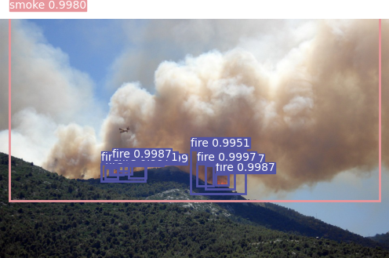
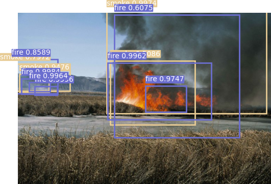
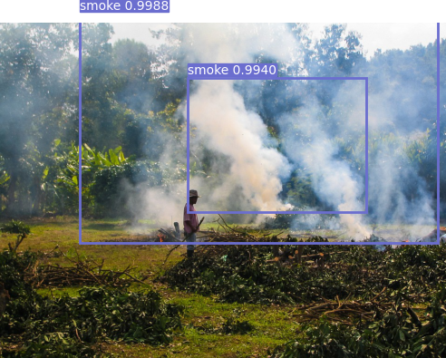
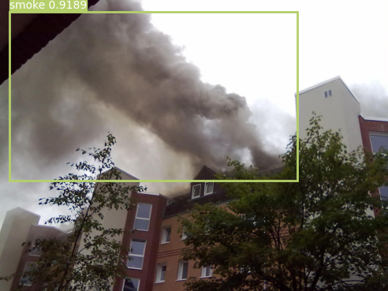
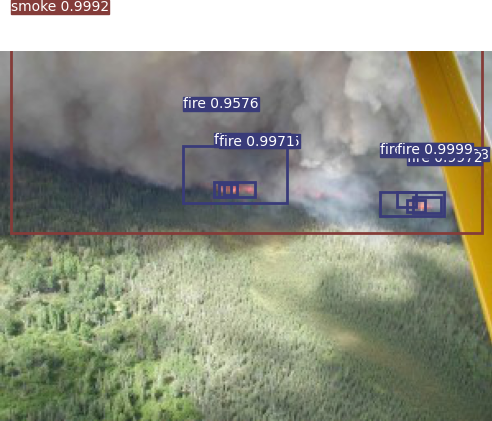
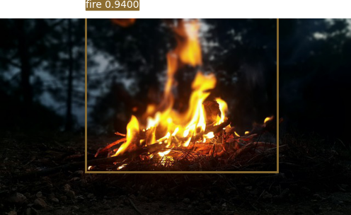

# PyTorch-YOLOv3-wildfire
Minimal implementation of YOLOv3 in PyTorch.

## Table of Contents
- [PyTorch-YOLOv3](#pytorch-yolov3-wildfire)
  * [Table of Contents](#table-of-contents)
  * [Installation](#installation)
  * [Inference](#inference)
  * [Video](#video)
  * [Test](#test)
  * [Detect](#detect)
  * [Train](#train)
  * [Credit](#credit)


## THIS repo is forked from [packyan](https://github.com/packyan/PyTorch-YOLOv3-kitti)

## Installation
    $ git clone https://github.com/Wayne122/PyTorch-YOLOv3-wildfire.git
    $ cd PyTorch-YOLOv3-wildfire/
    $ sudo pip3 install -r requirements.txt

##### Download pretrained weights
if you wan use pretrained darknet-53 on IMAGENET weights, please download [darknet53.conv.74](https://pjreddie.com/media/files/darknet53.conv.74),and put it into `checkpoints/`

if you just want a pretrained weights on wildfire dataset for test or detect, please download [pretrained weights file](https://drive.google.com/file/d/10Vkp9b1Yz4egEUhH3kJcAcMf7b0Fr5YE/view?usp=sharing), and put it into `weights` folder, the path:
`weights/yolov3-wildfire.weights`

## Inference
Uses pretrained weights to make predictions on images. `weights/wildfire_best.weights` was trained by wildfire data set.
`python3 detect.py --image_folder /data/samples`

<p align="center"></p>
<p align="center"></p>
<p align="center"></p>
<p align="center"></p>
<p align="center"></p>
<p align="center"></p>

## Detect

run`detect.py` to detect objects, and please  put samples into `data/samples`
defult weights files is `weights/yolov3-wildfire.weights`

## Video

run `video.py` to detect objects from a webcam or a video file.

## Test

run `test.py`

## Train
Data augmentation as well as additional training tricks remains to be implemented. PRs are welcomed!
```
    train.py [-h] [--epochs EPOCHS]
                [--batch_size BATCH_SIZE]
                [--model_config_path MODEL_CONFIG_PATH]
                [--data_config_path DATA_CONFIG_PATH]
                [--weights_path WEIGHTS_PATH] [--class_path CLASS_PATH]
                [--conf_thres CONF_THRES] [--nms_thres NMS_THRES]
                [--n_cpu N_CPU] [--img_size IMG_SIZE]
                [--checkpoint_interval CHECKPOINT_INTERVAL]
                [--checkpoint_dir CHECKPOINT_DIR]
```

## Credit
```
@article{yolov3,
  title={YOLOv3: An Incremental Improvement},
  author={Redmon, Joseph and Farhadi, Ali},
  journal = {arXiv},
  year={2018}
}
```
